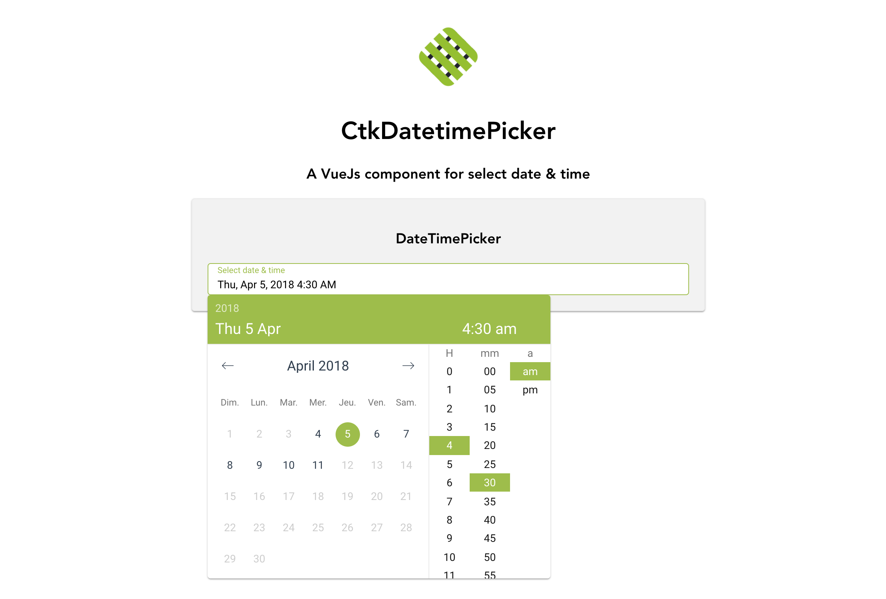

# vue-ctk-date-time-picker

> A vue component for select date & time (by Chronotruck)

## Demo
A [demo](https://htmlpreview.github.io/?https://github.com/chronotruck/vue-ctk-date-time-picker/blob/master/demo/dist/index.html) is available

## Install

``` bash
npm install vue-ctk-date-time-picker --save
```
#### In single component
``` js
import CtkDateTimePicker from 'vue-ctk-date-time-picker'

var yourComponent = new Vue({
  components: { CtkDateTimePicker },
  ...
})
```
``` html
<template>
  ...
  <ctk-date-time-picker
    v-model="value"
    label="Choose a date time"
    :hint="'Text'"
    :error-hint="true"
    color="#FF0000" />
  ...
</template>  
```

## Props API

| Props      | Type       | Required | Default    |
|------------|------------|----------|------------|
| v-model    | String/Int | yes     | -          |
| label      | String     | no    | Select date & time |
| hint*       | text       | no       | -         |
| error-hint** | Boolean    | no      | false     |
| color***     | String (hex) | no    | dodgerblue |
| minute-interval | Int | no    | 1    |
| formatted   | string | no    | 'llll' (momentjs format) |
| format   | string | no      | 'YYYY-MM-DDTHH:mm' |
| time-format   | string | no  | 'H:mm a' |
| locale   | string | no     | en |
| disable-time   | Boolean | no     | false |
| disable-date   | Boolean | no  | false |
| without-header   | Boolean | no   | false |
| id  | string | no  | CtkDateTimePicker |
| min-date****  | string | no  | - |
| max-date****  | string | no  | - |
| without-button-action | Boolean | no | false |

*hint : Is a text that replaces the label/placeholder

**error-hint : When is `true` --> Input border & label are red

***color: Replace color for the hint, the borders & time selected in dropdown

****min-date & max-date : Must be 'YYYY-MM-DD' format

## Contribution

``` bash
# install dependencies
npm install

# serve with hot reload at localhost:8080
npm run dev
```
