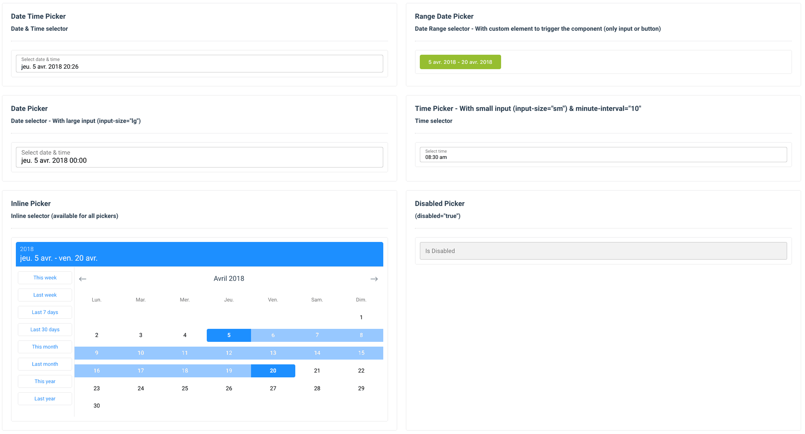

<!--  -->

# VueCtkDateTimePicker

> A vue component for select dates (range mode available) & time

[](https://circleci.com/gh/chronotruck/vue-ctk-date-time-picker/tree/master)

This documentation is for v2.\*. Find v1 documentation [here](./assets/doc-v1.md)



## Dark mode


# Demo

[Enjoy](https://chronotruck.github.io/vue-ctk-date-time-picker/)

# Installation

Yarn

```bash
yarn add vue-ctk-date-time-picker
```

NPM

```bash
npm i --save vue-ctk-date-time-picker
```

# Usage

## ES6 Modules / CommonJS

```js
import VueCtkDateTimePicker from 'vue-ctk-date-time-picker';
import 'vue-ctk-date-time-picker/dist/vue-ctk-date-time-picker.css';

Vue.component('VueCtkDateTimePicker', VueCtkDateTimePicker);
```

```html
<VueCtkDateTimePicker v-model="yourValue" />
```

## UMD

```html
<link
  rel="stylesheet"
  type="text/css"
  href="${YOUR_PATH}/vue-ctk-date-time-picker.css"
/>

<div id="app">
  <VueCtkDateTimePicker v-model="yourValue"></VueCtkDateTimePicker>
</div>

<script src="https://unpkg.com/vue" charset="utf-8"></script>
<script
  src="${YOUR_PATH}/vue-ctk-date-time-picker.umd.min.js"
  charset="utf-8"
></script>

<script type="text/javascript">
  Vue.component('vue-ctk-date-time-picker', window['vue-ctk-date-time-picker']);
  new Vue({
    el: '#app',
    data() {
      return {
        yourValue: null
      };
    }
  });
</script>
```

Here is an example of [UMD implementation](https://codepen.io/louismazel/pen/jQWNzQ).

## Use custom element to trigger the component (using [Slots api](https://v3.vuejs.org/api/directives.html#v-slot))
```html
<VueCtkDateTimePicker>
  <template v-slot="{ dateFormatted, toggleDatePicker, isOpen, close }">
    ...
    <input
      type="text"
      :value="dateFormatted"
      @focus="toggleDatePicker(true)"
    >
    ... or
    <button
      type="button"
      @click="toggleDatePicker(true)"
    >
      {{ dateFormatted }}
    </button>
    ...
  </template>
</VueCtkDateTimePicker>
```

# Props API

| Props                       | Type              | Required | Default                     |
| --------------------------- | ----------------- | -------- | --------------------------- |
| v-model                     | String            | yes      | -                           |
| format                      | String            | no       | 'YYYY-MM-DD hh:mm a'        |
| formatted                   | String            | no       | 'llll' (momentjs format)    |
| label                       | String            | no       | Select date & time          |
| hint (1)                    | String            | no       | -                           |
| error (2)                   | Boolean           | no       | false                       |
| color (3)                   | String (hex)      | no       | dodgerblue                  |
| button-color (4)            | String (hex)      | no       | #00C853                     |
| position                    | String            | no       | null                        |
| locale (5)                  | String            | no       | Browser Locale              |
| persistent                  | Boolean           | no       | false                       |
| minute-interval             | Integer           | no       | 1                           |
| output-format               | String            | no       | null                        |
| only-time                   | Boolean           | no       | false                       |
| only-date                   | Boolean           | no       | false                       |
| no-label                    | Boolean           | no       | false                       |
| no-header                   | Boolean           | no       | false                       |
| min-date (6)                | String            | no       | -                           |
| max-date (6)                | String            | no       | -                           |
| no-weekends-days            | Boolean           | no       | false                       |
| auto-close                  | Boolean           | no       | false                       |
| inline                      | Boolean           | no       | false                       |
| overlay                     | Boolean           | no       | false                       |
| range                       | Boolean           | no       | false                       |
| dark                        | Boolean           | no       | false                       |
| no-shortcuts                | Boolean           | no       | false                       |
| no-button                   | Boolean           | no       | false                       |
| input-size                  | String (sm or lg) | no       | null                        |
| button-now-translation      | String            | no       | 'Now'                       |
| no-button-now               | Boolean           | no       | false                       |
| first-day-of-week           | Int (0 to 7)      | no       | -                           |
| disabled-dates (7)          | Array`<string>`   | no       | []                          |
| disabled-hours (8)          | Array`<string>`   | no       | -                           |
| shortcut                    | String            | no       | -                           |
| custom-shortcuts (9)       | Array`<object>`   | no       | -                           |
| disabled-weekly (10)        | Array`<integer>`  | no       | []                          |
| no-keyboard (11)            | Boolean           | no       | false                       |
| right (12)                  | Boolean           | no       | false                       |
| noClearButton               | Boolean           | no       | false                       |
| behaviour                   | Object            | no       | [See behaviour](#Behaviour) |
| id (13)                     | String            | no       | undefined                   |

(1) hint : Is a text that replaces the label/placeholder (Ex : Error designation)

(2) error : When is `true` --> Input border & label are red

(3) color: Replace color for the hint, the borders & picker color

(4) button-color: Replace color for the buttons on bottom (validation & 'now')

(5) locale : Default value is the locale of the browser - Ex : Set `locale="fr"` to force to French language

(6) min-date && max-date should be in the same format as property format specified. If format not set - it is set to 'YYYY-MM-DD hh:mm a' by default

(7) Disabled-Dates is an Array of dates in 'YYYY-MM-DD' format (ex: `['2018-04-03', '2018-04-07', '2018-04-09']`)

(8) disabled-hours : Must be an Array of hours in 24h format ('00' to '23') : `['00','01','02','03','04','05','06','07','19','20','21','22','23']`

(9) custom-shortcuts - It's an array of objects. Each object represents a single shortcut.

```js
[
  { key: 'thisWeek', label: 'This week', value: 'isoWeek' },
  { key: 'lastWeek', label: 'Last week', value: '-isoWeek' },
  { key: 'last7Days', label: 'Last 7 days', value: 7 },
  { key: 'last30Days', label: 'Last 30 days', value: 30 },
  { key: 'thisMonth', label: 'This month', value: 'month' },
  { key: 'lastMonth', label: 'Last month', value: '-month' },
  { key: 'thisYear', label: 'This year', value: 'year' },
  { key: 'lastYear', label: 'Last year', value: '-year' }
];
```

Shortcut types allowed are : `['day', '-day', 'isoWeek', '-isoWeek', 'quarter', 'month', '-month', 'year', '-year', 'week', '-week']`
For each shortcut, a `key`, `label` and `value` must be specified. The `key` is a unique key for that specific shortcut.
Additional values can be passed as a `callback` function that will be called whenever the user clicks on the shortcut. The callback receives an object as first argument with the `start` and `end` values, with the `shortcut` object itself.
You can use this feature for translate existings shortcuts.
If the **value of shortcut is a number** (Integer), this number correspond to number of day (for 5 --> Last 5 days).

If the **value of shortcut is a function**, we'll use it to generate the `start` and `end` values. This function should return an object with the start & end values. Both values **must be a moment object**. The function is called when the user clicks on the shortcut button.

```js
[
  {
    key: 'customValue',
    label: 'My custom thing',
    value: () => {
      return {
        start: moment(),
        end: moment().add(2, 'days')
      }
    },
    callback: ({ start, end }) => {
      console.log('My shortcut was clicked with values: ', start, end)
    }
  },
];
```

With the `shortcut` property, you can specify a shortcut that's selected by default by passing it's `key` value.

```js
  :shortcut="'thisMonth'"
```

(10) disabled-weekly : Days of the week which are disabled every week, in Array format with day index, Sunday as 0 and Saturday as 6: `[0,4,6]`

(11) no-keyboard : Disable keyboard accessibility & navigation

(12) right : add this attribute to align the picker on right

(13) id : it assign id such as 'passedstring-input' to input help diffrentiate between two date-time-picker on same component.

> Any additionnal attribute passed to the component will be automatically be binded to the input component. (eg. if you passes a `type` attribute, the `<input>` will receive it).

## Behaviour

In order to avoid having too much properties in the component, We're adding a `behaviour` property that is an object including some annex behaviour values.

The default value for this object is:

```js
{
  time: {
    nearestIfDisabled: true;
  }
}
```

To override those values, pass a new object with the values you want to override:

```html
<ctk-date-time-picker
  :behaviour="{
    time: {
      nearestIfDisabled: false
    }
  }"
/>
```

| Behaviour              | Description                                                                                                                                                                                                                                                                                                                                                                       | Type    | Default |
| ---------------------- | --------------------------------------------------------------------------------------------------------------------------------------------------------------------------------------------------------------------------------------------------------------------------------------------------------------------------------------------------------------------------------- | ------- | ------- |
| time.nearestIfDisabled | If `true`, it will select the nearest available hour in the timepicker, if the current selected hour is disabled. Per example, if the hour is 12 but all the hours have been disabled until 14, then the 14 will be selected by default. Set `false` to disable this behaviour; the current hour will remain selected even if it has been disabled. The user cannot re-select it. | Boolean | true    |

# Events API

| Event           | Return                                            |
| --------------- | ------------------------------------------------- |
| input           | value (formatted with 'format' props)             |
| formatted-value | value (formatted with 'formatted' props)          |
| is-shown        | Component is shown                                |
| is-hidden       | Component is hidden                               |
| validate        | Click on validate button (so component is closed) |
| destroy         | Component is destroy                              |

# Keyboard Accessible

| Key            | Action                     |
| -------------- | -------------------------- |
| Arrow Right    | Next Day                   |
| Arrow Left     | Previous Day               |
| Arrow Down     | Same day on next week      |
| Arrow Up       | Same day on previous week  |
| Page Down      | Same day on previous month |
| Page Up        | Same day on next month     |
| Enter or Space | Select day                 |
| Escape         | Close component            |

# Upcoming features (Todo)

- Double Calendar on RangeDatePicker (issue : #33)
- Inputs Text to choose values (issue #30)
- TimePicker seconds support (issue : #79)

# Contribute

## Setting up development server

### Without Docker

Ensure you have Node and npm in your machine. Minimal config is:

- node >= 6.0
- npm >= 3.0

> This project is built with `node@10.x`.

Install the development dependencies by running:

```bash
npm install
```

or

```bash
npm ci # Recommanded if you have node > 10.x
```

Once your dependencies are installed, start the development server with:

```bash
npm run serve
```

This will start the development server available at `http://localhost:8080`.

### Docker

To easily set-up your development environment, you can spin up a container containing the development app.
For that, you need Docker with docker-compose in your machine.

Once you've everything running, you can simply run the following command to start the dev server:

```bash
docker-compose up -d
```

This will start the development server inside a container and accessible through `http://localhost:8080`.

## Compiles and hot-reloads for development

```bash
npm run serve
```

## Linter

```bash
npm run lint
```

## Tests

Work in progress

# License

This project is licensed under [MIT License](http://en.wikipedia.org/wiki/MIT_License)

# Credit

Open source time proudly sponsored by [Chronotruck](https://www.chronotruck.com)
